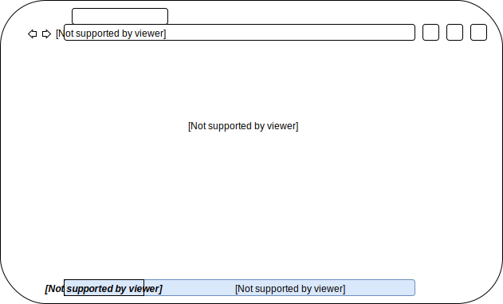

# A Journey to Proof of Knowledge

## Information to Knowledge

We spend our days consuming *information*. That information could come in the form of a PDF, an article on Medium, a video on YouTube, an email, or a TED talk. As we consume, our mind parses and plays with the information, embedding it into our synapses, adding our own twists and takes on it, putting it through our personal filter. What comes out the other end is *knowledge*, a usable resource. We then use that knowledge to make decisions, guide conversations, and generally, to create value.

> Each time we consume information, we parse and analyze it, creating value-add thoughts that are captured in our mind as knowledge.

## Experts

Although we all have value add thoughts as we consume information, some of us are better at capturing and retaining those as knowledge that can be leverage at a future date. We believe that those people who are exceptional at retaining, curating, and analyzing the knowledge they create are what we commonly call *experts*.

> Experts are those that are best at retaining, recalling, and leveraging the knowledge they have created.

Whether it is Jerry Seinfeld capturing every joke he has ever come up with in handwritten notes that can cover an entire [New York City street](https://youtu.be/ya-OBX5agNk?t=2m35s) or Steph Curry watching the film from every game he has ever played, these experts are extending and honing their abilities through the creation and curation of personal *knowledge bases*. When Jerry is working on a new piece and has a recollection of a joke he once thought of, he can reference his notes and build on his previous work. When Steph is studying the film of an upcoming opponent and remembers facing a similar defense, he can reference and query the old game film and build on what he did well. In both cases, Jerry and Steph are leveraging the knowledge they have created and retained to push themselves forward faster. We believe that this something we can all do... with the right tools.

> The ability to create, curate, and query personal knowledge bases is something that would benefit us all.

## Product

Imagine now you are watching that YouTube video or TED talk and you have that moment of inspirational thought. You note your thought directly in the browser. That note gets stored with a link to the video and associated metadata in your knowledge base.

> We will design tooling to capture notes and insights directly in the browser alongside the content / information you are consuming.

However, this *active noting* is only one method for systematic knowledge capture. Imagine now you are reading a PDF, an email, or your Twitter feed. Your cursor lingers over a sentence in the PDF, an entity in the email, a tweet in your feed. This text gets stored with a link to the source and associated metadata in your knowledge base.

> We will design tooling to passively capture what you find interesting in the content / information you are consuming.

Using a combination of active noting and *passive noting* to systematically capture the micro insights we have on a daily basis, we are each capable of creating a powerful personal knowledge base. Now when you find yourself going into a meeting with your boss and she brings up the *blockchain*, you are not left straining your mind to come up with something to say. Instead, you can immediately query your knowledge base for that fleeting insight of the implications of the blockchain for your company you had while watching that YouTube video of Vitalik Buterin in the wee hours of the night. Your insightfullness has led to you directing the blockchain initiative for your company.

> By building not only the tools so that each of us can capture the insights and knowledge we generate each day through our information consumption, but also the interface to query that knowledge base, we will be empowering each of us to become experts in the things we do each and every day.

## But How

So how do we get from zero to the platonic ideal of a product capable of capturing each value add thought we have in a personal knowledge base for later recall and analysis? We believe the answer is that we get there by addressing a clear business need. Our experience in the professional services industry has led us to realize that so much of the knowledge created by employees over the course of a day go uncaptured and unleveraged. There is an intense focus on final deliverable content creation. This means that the knowledge that is ultimately captured by the organizational infrastructure is limited to what makes it into a final report or deck. This entails losing the many micro level insights each employee has as they consume information and interact with others within the organization.

> How do we create tooling to capture the micro-level insights generated by employees as they consume information and interact with others within the organization?

Imagine if we instead redesigned the professional services firm to focus on capturing and retaining these micro-level insights, what might that look like? A professional services firm is in many ways like the individual expert but at a massive scale. These firms consume vast amounts of qualitative information and data, parse and analyze it, producing knowledge that can ultimately be used to support the endeavors of their clients. Like the expert, the better they are at creating, capturing, and querying their knowledge base, the better they will be at achieving their goals.

> Professional service firms and experts share many similarities, both excel at generating usable knowledge from information and experience that furthers their ability to achieve.

We therefore believe that professional services firms place a high premium on expanding their usable knowledge bases. We can define a mathematical model for how a firm operates then and see how a knowledge capture tool fits in. Let $U$ be the utility of a firm $f$. Per our discussion, the utility of a firm is equal to its ability to produce value for its clients from its knowledge base. Thus we can define the utility of a firm as a function of the value gained from acquiring new knowledge minus the cost of acquiring that knowledge. Let us define $v$ as value gained from a piece of usable knowledge. Let us define $\alpha$ as the portion of knowledge that is not valuable for the current goals of the firm. Let us define $K$ as the set of all knowledge in a firms knowledge base. Let there be $n$ pieces of knowledge in the knowledge base. Let us define $c$ as the cost acquiring a piece of knowledge. A simple model for a firm's utility would look as follows:

$$ U(f) =  \frac{v}{\alpha} K - c K $$ (1)

$$ U(f) = \frac{v}{\alpha} \sum_{i=1}^n k_i - c \sum_{i=1}^n k_i $$ (2)

> The utility of a firm is equal to the value of the usable knowledge in the firm's knowledge base minus the cost of acquiring that knowledge.

We can now simplify this model to see how a tool focused on capturing the micro-level insights of employees could benefit the firm.

$$ U(f) = K(\frac{v}{\alpha} - c) $$ (3)

From this we can see that as long as the cost of acquiring knowledge is less than the value of the usable knowledge, one should acquire as much knowledge as possible.

$$ \frac{v}{\alpha} > c $$ (4)

$$ v > \alpha c $$ (5)

Although simple, we can generate insights from the equation. As long as the burden of using the tooling we develop does not increase the cost of acquiring usable knowledge over the value of that knowledge, the tooling will provide utility for the firm. Furthermore, we would argue that the portion of knowledge that is not valuable to the firm $alpha$ is a decreasing function proportional to the amount of knowledge in the knowledge base. This is because we believe that like networks, where (per [Metcalfe's Law](https://en.wikipedia.org/wiki/Metcalfe%27s_law)) the value is proportional to the square of the number of connected nodes, the amount of valuable knowledge in a knowledge base is proportional to the size of the knowledge base raised to some positive constant $\beta$. We can express this mathematically as the following.

$$ \frac{1}{\alpha} \propto |K|^{\beta} $$ (6)

$$ \alpha \propto \frac{1}{|K|^{\beta}} $$ (7)

Thus as our tools draw connections between the content being consumed, the employee consuming it, and their micro-insights, we will see exponential growth in the value of the knowledge base; offsetting the initially higher costs of using the tooling.

$$ v > \frac{c}{|K|^{\beta}} $$ (8)

> By capturing the connections between the information being consumed, the consumer of that information, and their micro-insights we will drastically increase the value of a firms knowledge base.

So why start with an enterprise software product? Since these firms have large knowledge bases already and a large number of individuals contributing to them the portion of usable knowledge (read $\frac{1}{\alpha}$ or $|K|^{\beta}$) generated will be higher than with a single average consumer. This means that the initial higher costs (read frictions) of acquiring knowledge with early versions of the tooling will be offset by faster gains for the firm as a whole than would occur for an individual consumer. This combined with a clearer monetization strategy for providing an enterprise product makes it a natural starting point.

> An enterprise software as a service product provides a clear path towards monetization and more immediate value add, offsetting the ease of use frictions of early versions of the tooling.

So how would this look in practice? Imagine a VP at a data management consulting firm has been hearing about sky rocketing Bitcoin prices and how the underlying technology, blockchain, could have sweeping implications for the internet, ushering in web 3.0. You don't know how blockchain works or what it might mean for your clients. You open your enterprise knowledge base portal and query for "blockchain". To your surprise you find that three of your employees have been generating micro-insights over the last year relating to blockchain. It turns out they trade cryptocurrencies in their free time and as they worked could not help but note how the underlying technology of these cryptocurrencies might affect the clients they are working for. You set up a meeting with these employees and begin to develop a coherent strategy for addressing how your clients will be affected by blockchain technology and decentralization movement.

> By capturing the small insights generated by people each day, enterprises have a better chance of being able to respond to unexpected circumstances by being able to provide resources to the right people at the right time.

By focusing on enterprises first, who have higher tolerance for friction to the greater immediate value add to increasing knowledge base growth, we can iterate the tooling with their feedback such that the frictions associated with the capture of knowledge generated from content consumption reach a point that would not inhibit use by the average consumer who may not see the immediate utility gains from a personal knowledge base. Since we believe that this knowledge capture is something that people will do often, even small frictions will have high costs over time. We can see how powerful eliminating small frictions can be by taking note from the ease of use of unlocking an iPhone as it has gone from pin codes, to TouchID, to FaceID. We do not want to start with a consumer product where the frictions of use are prohibitive because the gains are likely to accrue in the long run as a sizeable personal knowledge base is generated by the individual.

> Since enterprises will have more immediate gains from the tooling, their feedback can be used to eliminate frictions until we believe the tooling is at a point where individual consumers will not be deterred.

We believe that it would also be possible to enter a joint venture with a professional services firm. This would create a synergistic relationship that is captured in the following chart.

> Whether internally or externally, we believe a joint venture would provide high synergistic value.

## So What

Basically we want to create a suite of tools that exist wherever people consume information and content that make it exceptionally easy to store new knowledge in their own knowledge base (or in the case of an enterprise, a collective knowledge base). We are going to walk through the components of the product in the order in which a user would likely experience them.

### Frontend Storing

Our goal with the frontend will be to provide unobtrusive, but intuitive ways for individuals to quickly and easily capture new knowledge.

#### Browser Extension

A browser extension could facilitate both passive and active knowledge capture. It could take the following form.

In this case the user has visited a site and highlighted some content use the extension. The then write a note in the knowledge base bar rendered at the bottom in blue. This note also has tags associated with it in the form "#tag". When the user hits enter, this note, along with a reference to this article and the highlight will be stored in their knowledge base.

Simultaneously, we will leverage technologies that have traditionally been used by third parties to track and learn about you for serving adds to capture what interests you on the page. This capture of "interesting" information will supplement your knowledge base as there is a high likelyhood the content you engage with most strongly is what you are most interested in and thus most interested in recalling at a future date. This passive capture will be able to be toggled.

When viewing content in the browser, you can imagine how revisiting a site, the extension could automatically highlight and annotate the page with what you noted and found interesting the last time you were there. With the collecting knowledge base for enterprises you can imagine for documents and articles read in the browser you could see what your colleagues found interesting as well as their value add insights.

The functionality would be similar for video content consumed in the browser.

#### Slack Bot / Text Bot / Email Bot

You can imagine being able to send messages with similar format as the note in the browser while including links, images, and attached files to a bot on any communication platform that would then take message and attachments and store them in your knowledge base. This could be as simple as forwarding an email with your value add thoughts.

#### Document Integration

We believe that proprietary formats like Word and PowerPoint are outdated and prevent the knowledge captured within those documents from being fully leveraged. Instead we believe that there should be a write once, compile anywhere philosophy using such things as markdown as the base format. In doing so you can imagine writing custom compilers that could extract insights from the content you produce and store it in your knowledge base.

#### Alexa / Siri / Hello Google

We believe that ambient computing via voice enabled assistants will only continue to become more ubiquitous. As such it is important that you be able to add to your knowledge base using these assistants. You can imagine saying, "Alexa, store blockchains are going to enable new types of decentralized marketplaces for non traditional assets in my knowledge base."

### Backend

We believe that each knowledge base will be stored as a graph database. Nodes in this database will likely include: entities, sentiments, links / documents / videos, and tags. When you enter a new piece of knowledge, machine learning will be used to extract entities and sentiment. If images or videos are attached, computer vision algorithms will be used to extract entities from them. When a new piece of knowledge is added to the knowledge base, edges will be created between it and the associated resources previously listed.

> Using a graph database will allow us to effectively capture the ever growing relationships between new and old knowledge, maximizing the ability to provide value for the individual.

Imagine we are storing the piece of knowledge seen in the [browser extension diagram](#browser-extension) ("blockchains could disrupt our business #decentralization #ethereum"). There is a new piece of knowledge, some tags, and an article. The following visualizes what that might look like in a graph database or your knowledge base.

The above diagram captures how new knowledge would be captured in the knowledge base and related to each of its associated resources. It is important to note that although the piece of inputted knowledged did not contain any reference to the person "Vitalik Buterin", previous associations between the tags "ethereum" and "decentralization" and the entity "blockchain" mean that in the knowledge base, the person "Vitalik Buterin" is closely associated with that piece of knowledge. Over time, it is our hope that the system improves at connecting nodes in the graph (edge creation), increasing value for the end user.

### Frontend Retrieving

The front end retrieval is likely the most intuitive aspect of this system. Imagine interacting with it like any other search service, except that the results are sourced from your personal knowledge base. You can imagine querying by "positive sentiment to blockchains" or "Vitalik Buterin". The results would include those pieces of knowledge most closely related to the nodes alluded to in the query. You can even imagine having a hybrid search that incorporates results from your personal knowledge base as well as from the internet at large.

> Recalling knowledge from your knowledge base will be as easy and intuitive as any other search service you use on a daily basis.

Beyond this, you can imagine how the knowledge base could passively provide value for you beyond actively querying it. Imagine in the enterprise version you are reading a document in the browser that many employees at the firm have read. Instead of appearing as a blank document, the browser extension could automatically highlight what others found interesting and annotate it with their knowledge gained while reading it. In this way content consumption becomes truly collaborative, building more and more value as more people consume and add micro-insights.

## Long-term Vision

In this section, we start with some large assumptions. The first assumption is that we have created the tooling around knowledge bases such that people have begun to use and build their own personal knowledge base with us, a centralized provider. Secondly, we assume that public blockchain technology has advanced in terms of usability and scalability such that decentralized storage at scale is feasible. We are agnostic to whether or not this type of decentralized storage at scale comes in the form of advancements in the Ethereum ecosystem (Storj / Filecoin), Blockstack's Gaia, or requires building our own blockchain. What we are excited about is what it means to put our knowledge bases on a public blockchain.

> Our goal is to put each individual's knowledge base in decentralized storage on a public blockchain.

So what are the implications of someone controlling the private keys to their own personal knowledge base on a public blockchain. First, due to the durability and immutability of public blockchains, each knowledge becomes a durable on chain asset. This means that as you build your knowledge base not only do you build value for yourself as you become more and more like an expert, you build value in perpetuity. Since you control the private keys to your knowledge base on the blockchain, you can now pass down your knowledge to your kids, or donate it to a foundation you care about.

> By storing our knowledge bases on a public blockchain, we are turning them into assets that can be used and exchanged in any way we deem appropriate.

Since our knowledge bases would exist on a public blockchain, we can design a *proof of knowledge* protocol that allows individuals to attest to what they know. This could be achieved with public key cryptography and zero knowledge proofs. Imagine a business is realizing that blockchains really do have the potential to revolutionize their industry, but have no one at the company that has any experience with them. As such they seek to higher someone with expertise on blockchains. Instead of vetting resumes, the business ask applicants to run an algorithm on their knowledge the amount of knowledge they have produced relating to blockchains. Using the *proof of knowledge* protocol they can verify that the individual did in fact run the algorithm on their knowledge base. Now the business has clear picture of who is actually an expert on blockchains. One concern is that people could "pump" their knowledge base with information automatically to appear like an expert. I believe that this can be prevented in several ways. First is via a reputation system where enterprises, colleagues, and trusted third parties can attest to your knowledge base validity by signing portions of it with their private key. Secondly, if this truly becomes a mechanism for passing knowledge down from generation to generation, it is our hope that people do not sacrifice the long-term value of their knowledge base for short-term gains.

> We believe that the ability to attest to knowledge via a proof of knowledge protocol could revolutionize how we think about and vet expertise.

Now we can get into the really wild stuff. Up to this point we have our knowledge bases stored on a public blockchain, which we can attest to via a proof of knowledge protocol. If the current trends continue, it would not be surprising if a decentralized marketplace for knowledge comes into existence. Imagine the company is looking to hire a blockchain expert again. Now instead of hiring the expert, they purchase an expiring key to query on the experts knowledge base on blockchains in a decentralized marketplace.

> We believe that once knowledge becomes an asset on the blockchain, there will be decentralized markets for it.

Our final wildest thought is that if we create a decentralized marketplace for knowledge, and human computer linking becomes feasible, that marketplace will serve as the mechanism for buying and downloading new knowledge into your brain...

## Our Vision

Ultimately, we want to empower people by helping them capture the knowledge they create each day and allow them to leverage it however they see fit.

We believe that everyone, not just those who write books, have a right to pass down the knowledge they have acquired over a lifetime.

Each piece of knowledge we gain has value, not only to us but to society as a whole. When we let those pieces of knowledge slip through the cracks of our forgetful brains we are not only doing ourselves a disservice, but all of society.