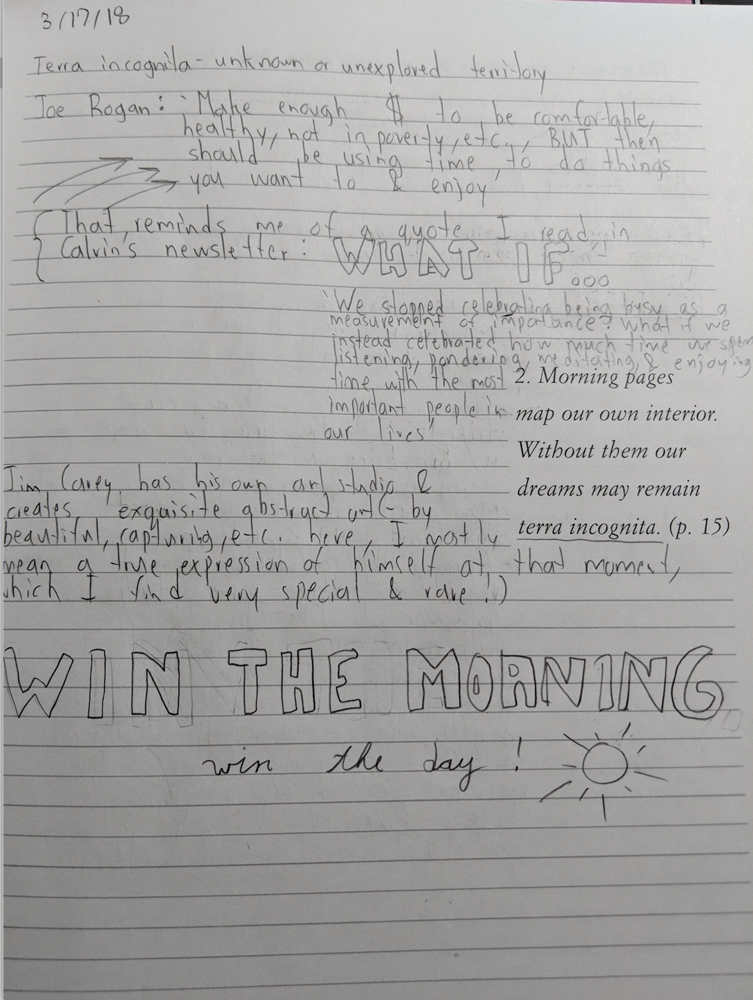
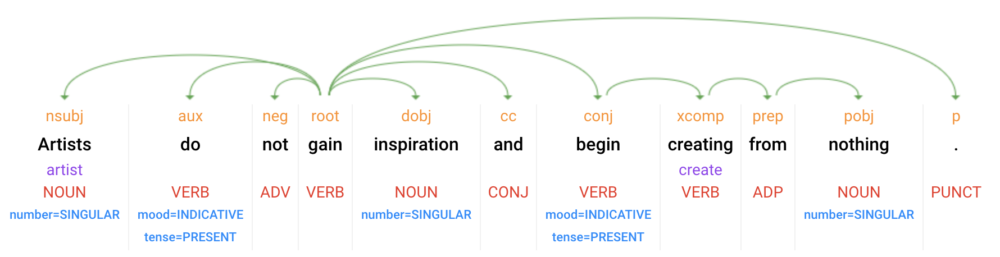
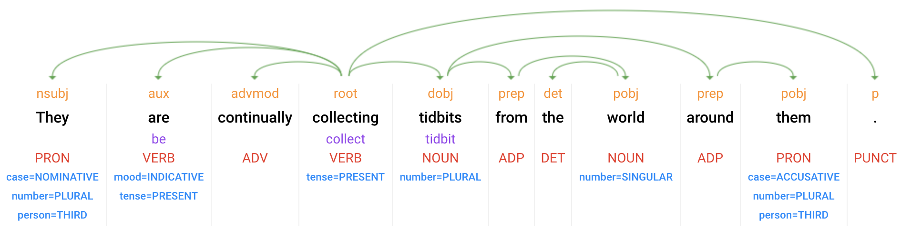

### Morning Pages

The bedrock of my day is an exercise called [morning pages](https://tim.blog/2015/01/15/morning-pages/) – a free-flow cup of coffee with myself, where I put pen (or, in this case, pencil) to paper and jot whatever comes to mind. Some days these are a stream of consciousness reflection on inspiration I’ve recently come across; other days a physical reservoir for project ideas that jump to mind. Though this has been a liberating habit of self-expression, it has the potential to be so much more…

First thing in the morning is when you are the most raw, intellectual version of yourself, brimming with micro-insights waiting to be captured! Wouldn’t it be nice if this collection of ruminations could be integrated over time and made sense of? And, even more, if all of this were automated? Vis-à-vis: the technical ability to finally do so _(cue exit: thought silos)_!

<iframe src="https://player.vimeo.com/video/86912300?byline=0&portrait=0" width="320" height="180" frameborder="0" webkitallowfullscreen mozallowfullscreen allowfullscreen></iframe>

### Enter Tangent

> When we think of artificial intelligence (AI) and machine learning (ML), we surface PopSci applications:

1. Waymo’s self-driving Chrysler zipping around San Francisco,
2. Deep-Blue besting the reigning world chess champion [oldie but a goodie](http://www.espn.com/video/clip?id=11694550), and
3. IBM’s Watson (and, I am quoting here) ‘destroying’ humans at Jeopardy.

Though the field entered popular awareness in the mid-1950s, the cloud has democratized access to the computational power needed to enable AI. Coupled with software utilities to handle large data sets (e.g. Hadoop), AI has seamlessly become a part of our everyday lives:

1. Siri, our favorite mobile personal assistant,
2. Personal search recommendations on Google, and
3. Mobile check deposits deciphering handwriting to text.

Be it FaceBook generating deeply-targeted (though, often unwanted) ads pertinent to your interests or Gmail learning from the sender of and words in a message to render you free of spam (thank you). ML, or the ability to statistically learn from and make predictive generalizations on data, underpins all of these technologies.

### Back to Thought Silos

Within this realm, a personal favorite of mine is natural language processing (NLP), which derives understanding from unstructured text. In the ML paradigm, a computer is trained by being fed a set of documents with hand annotated rules, such as the part of speech of each word in a given sentence. The training data is analyzed and a model is generated that probabilistically infers the part of speech for a word in a sentence based on the word, the surrounding words, and the part of speech of the surrounding words. Just as we get better with practice, given enough training data, a computer will achieve high predictive accuracy at tagging new text. Moreover, this exercise can be extended to segment other features such as tense, named entities, topics, and even [sentiment](https://en.wikipedia.org/wiki/Sentiment_analysis).

So, when are you going to tie this back to morning pages?

Perfect timing!

In the simplest version, my morning pages can be aggregated into text form and indexed in time order. Once our clever computer friend labels the features we’ve trained it to classify, the fun begins!

With the goal of synthesizing our parsed text into an output we can glean insights from, we can, for example, use statistical tools like clustering (surprise: more ML algorithms) to lump our thoughts into common themes. Recency and frequency can be included as factors to give more weight to the Jocko Willinck quote you couldn’t stop writing about yesterday relative to the Buddha quote that appears once a year ago.

With the seemingly endless number of schemas, this is the stage at which innovation swoops in to deliver summarized content in an actionable, digestible format. Although my siloed morning pages may be a jambalaya of thoughts, an automated reflection process can transform them into an effortless tool I levy for ideation, introspection, and inspiration.
